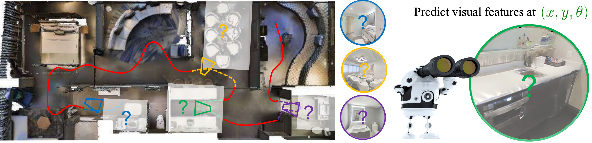

# Environment Predictive Coding for Visual Navigation

This repository contains a Pytorch implementation of our ICLR 2022 paper:

[Environment Predictive Coding for Visual Navigation](https://openreview.net/pdf?id=DBiQQYWykyy)<br/>
Santhosh Kumar Ramakrishnan, Tushar Nagarajan, Ziad Al-Halah, Kristen Grauman<br/>
UT Austin, Meta AI

Project website: [https://vision.cs.utexas.edu/projects/epc/](https://vision.cs.utexas.edu/projects/epc/)

<p align="center">
  
</p>

## Abstract
We introduce environment predictive coding, a self-supervised approach to learn environment-level representations for embodied agents. In contrast to prior work on self-supervised learning for individual images, we aim to encode a 3D environment using a series of images observed by an agent moving in it. We learn these representations via a masked-zone prediction task, which segments an agent’s trajectory into zones and then predicts features of randomly masked zones, conditioned on the agent’s camera poses. This explicit spatial conditioning encourages learning representations that capture the geometric and semantic regularities of 3D environments. We learn such representations on a collection of video walkthroughs and demonstrate successful transfer to multiple downstream navigation tasks. Our experiments on the real-world scanned 3D environments of Gibson and Matterport3D show that our method obtains 2 - 6× higher sample-efficiency and up to 57% higher performance over standard image-representation learning.

## Installation

Create a conda environment.
```
conda create -n epc_ssl python=3.8.5
```
Download this repo and set path the repository root to `$EPC_CODE_ROOT`.
Install pip dependencies.
```
pip install torch==1.8.1+cu101 torchvision==0.9.1+cu101 torchaudio==0.8.1 -f https://download.pytorch.org/whl/torch_stable.html
pip install -r requirements.txt
```
Update the submodules.
```
git submodule update --init --recursive
```
Install habitat-lab and habitat-sim.
```
cd $EPC_CODE_ROOT/dependencies/habitat-lab
pip install -r requirements.txt
python setup.py develop --all

cd $EPC_CODE_ROOT/dependencies/habitat-sim
pip install -r requirements.txt
python setup.py install --headless --with-cuda
```
Add repo to `PYTHONPATH`.
```
export PYTHONPATH=$PYTHONPATH:$EPC_CODE_ROOT
```


## Generating video walkthroughs

Download Gibson GLB files for habitat from [here](https://github.com/StanfordVL/GibsonEnv/blob/master/gibson/data/README.md). Create a symlink to the dataset at `$EPC_CODE_ROOT/data/scene_datasets/gibson`.
```
cd $EPC_CODE_ROOT
mkdir -p data/scene_datasets
cd data/scene_datasets
ln -s <GIBSON GLB DIRECTORY> gibson
```
Download exploration trajectories for Gibson scenes
```
cd $EPC_CODE_ROOT
mkdir -p data/walkthroughs/strong_exploration
mkdir -p data/walkthroughs/weak_exploration

cd $EPC_CODE_ROOT/data/walkthroughs/strong_exploration
wget -O strong_exploration_trajectories.tar.gz https://utexas.box.com/shared/static/o18q3erc5hoiqm8rnr4e0ogjliseeoig.gz
tar -xzf strong_exploration_trajectories.tar.gz && rm strong_exploration_trajectories.tar.gz

cd $EPC_CODE_ROOT/data/walkthroughs/weak_exploration
wget -O weak_exploration_trajectories.tar.gz https://utexas.box.com/shared/static/5j7m5r8mq28cbc2i1gt2e2bbgzn9ayqe.gz
tar -xzf weak_exploration_trajectories.tar.gz && rm weak_exploration_trajectories.tar.gz
```
Generate walkthrough videos corresponding to the exploration trajectories.
```
python epc/walkthrough_generation/generate_walkthroughs.py \
    --infos-root ./data/walkthroughs/strong_exploration/

python epc/walkthrough_generation/generate_walkthroughs.py \
    --infos-root ./data/walkthroughs/weak_exploration/
```

## Training image-level encoders
We first perform self-supervised pre-training of image-encoders using [MoCo](https://github.com/facebookresearch/moco).

Extract images from walkthrough videos.
```
cd $EPC_CODE_ROOT

python epc/moco_pretraining/convert_video_to_frames.py \
    --walkthroughs-dir ./data/walkthroughs/strong_exploration/
```
Pre-train image encoders using MoCo. We provide a pre-trained model [here](https://utexas.box.com/s/mocu24bxftvj7ricupvzm7skrs32kdmk).
```
mkdir -p data/experiments/moco/strong_exploration

python -u epc/moco_pretraining/train_moco.py \
    --config-path epc/moco_pretraining/configs/train_config.yaml \
    --lr 0.03 --batch-size 128 --dist-url 'tcp://localhost:13513' \
    --mlp --moco-t 0.2 --epochs 20000 --schedule 12000 16000 \
    --multiprocessing-distributed --world-size 1 --rank 0 \
    --save-interval 200 \
    --frames-per-video 4 \
    --save-dir data/experiments/moco/strong_exploration \
    data/walkthroughs/strong_exploration/
```

## Training EPC encoder
We then train the environment-level encoder using EPC masked-zone prediction.

Extract pre-trained MoCo image features for all video frames.
```
cd $EPC_CODE_ROOT

mkdir -p data/walkthrough_features/strong_exploration
mkdir pretrained_models
cd pretrained_models/
wget -O moco_encoder.pth.tar https://utexas.box.com/shared/static/mocu24bxftvj7ricupvzm7skrs32kdmk.tar

cd $EPC_CODE_ROOT
python -u epc/epc_pretraining/extract_video_features.py \
    --exp-config epc/epc_pretraining/configs/extract_features_config.yaml \
    --num-processes-per-gpu 8 \
    --save-root data/walkthrough_features/strong_exploration
```
Train EPC model using the video dataset of pre-extracted image features.
```
cd $EPC_CODE_ROOT
mkdir -p experiments/epc/strong_exploration/

python -u epc/epc_pretraining/train_epc.py \
    SAVE_DIR experiments/epc/strong_exploration/ \
    DATA_ROOT data/walkthrough_features/strong_exploration/ \
    VISUAL_ENCODER.RESNET.ENCODER.pretrained_path "pretrained_models/moco_encoder.pth.tar"
```

## Pre-trained models
We provide the pre-trained models for our primary experiments here: [Area coverage](https://utexas.box.com/s/h6tevp2e1cx8dqn84gtoqsho8naphajq), [Flee](https://utexas.box.com/s/359sj49kcceslteaoewsdfr9d93gilfh), [Object visitation](https://utexas.box.com/s/t3dphxfprg8852xuaiua3oekhvsmrggv), [RoomNav](https://utexas.box.com/s/ivpie0bhpxe49mzzf5kdt0nah4hc248a). These include checkpoints for both pre-trained encoders (for SMT-video, EPC), and RL trained policies (for all methods).

## RL training + evaluation
Coming soon.

## Acknowledgements
In our work, we used parts of [Habitat-Lab](https://github.com/facebookresearch/habitat-lab) and [Habitat-Sim](https://github.com/facebookresearch/habitat-sim).

## Citation
If you find this codebase useful, please cite us:
```
@inproceedings{
ramakrishnan2022environment,
title={Environment Predictive Coding for Visual Navigation},
author={Santhosh Kumar Ramakrishnan and Tushar Nagarajan and Ziad Al-Halah and Kristen Grauman},
booktitle={International Conference on Learning Representations},
year={2022},
url={https://openreview.net/forum?id=DBiQQYWykyy}
}
```

## License
This project is released under the MIT license, as found in the [LICENSE](LICENSE) file.
